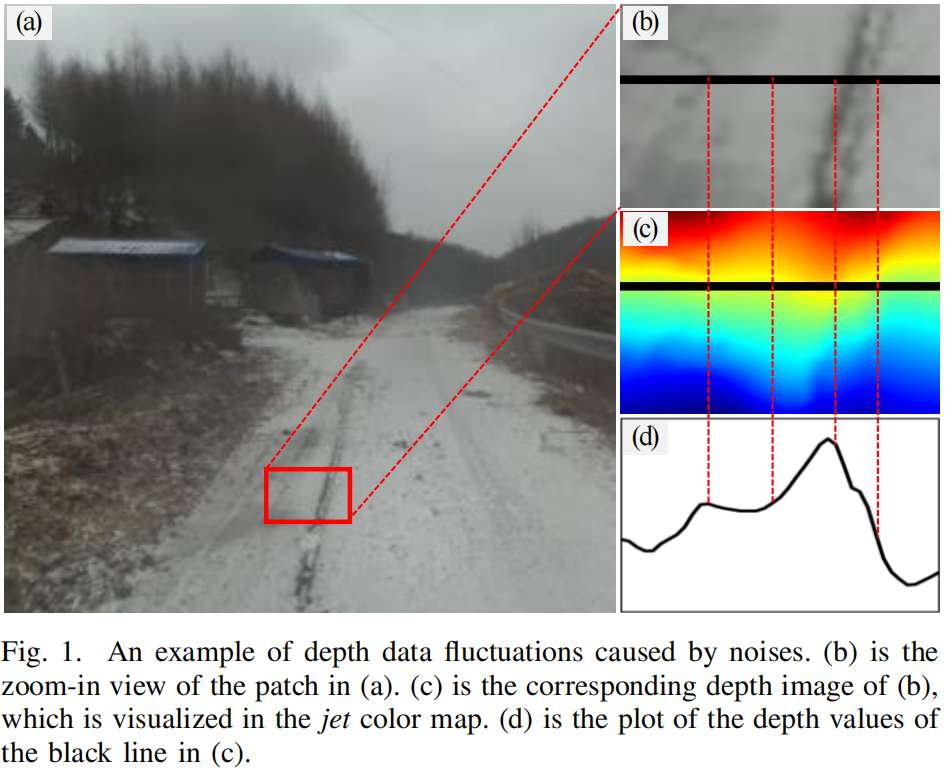
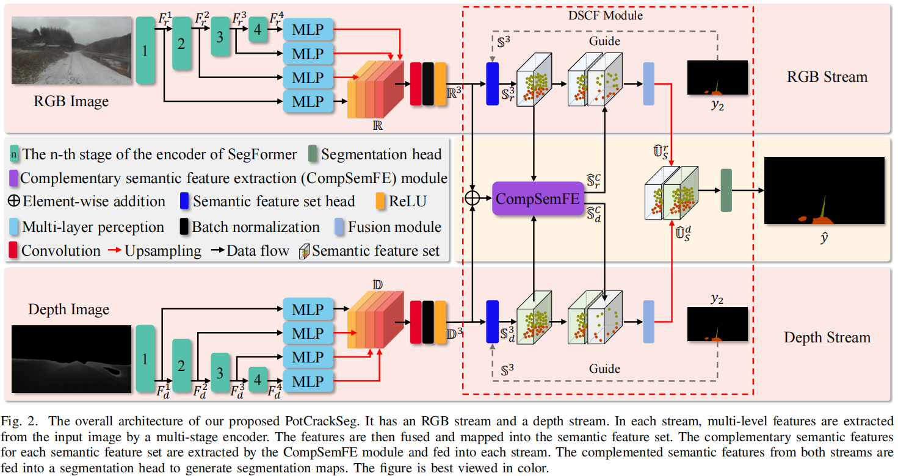
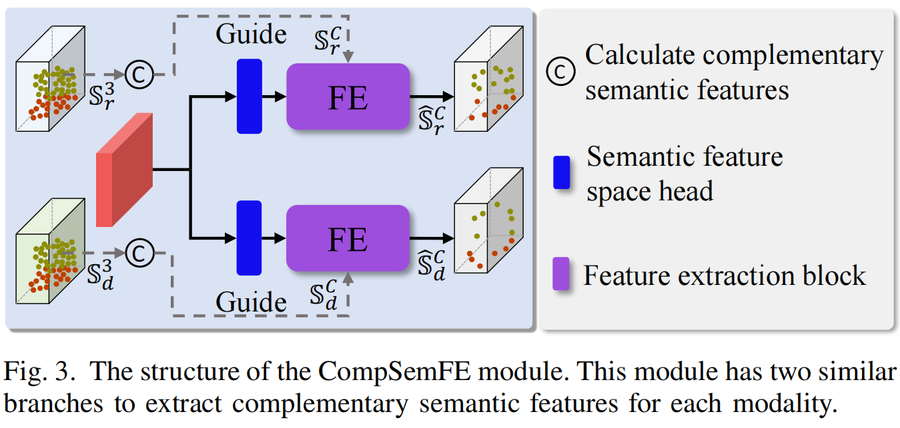
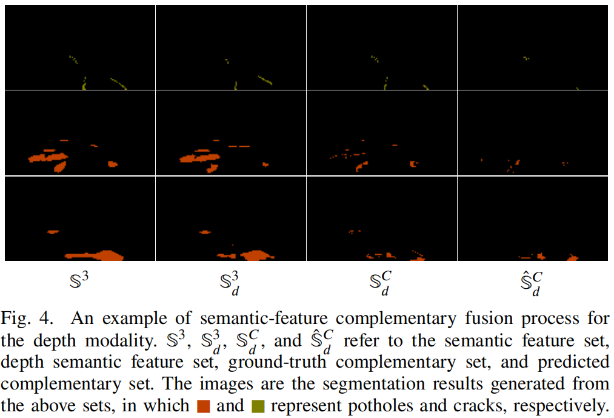
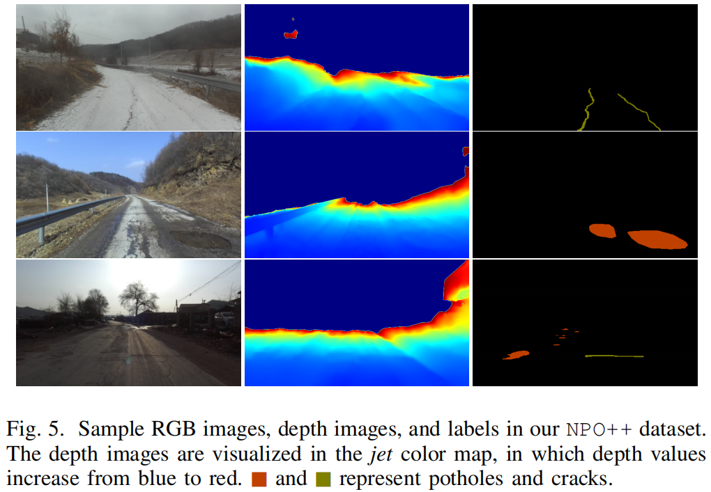
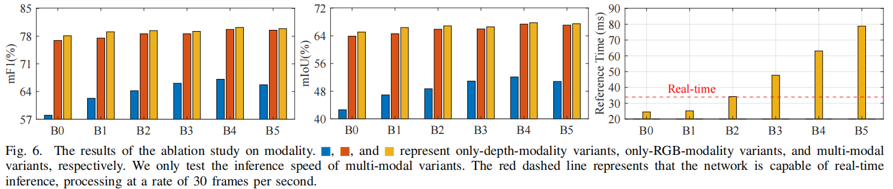
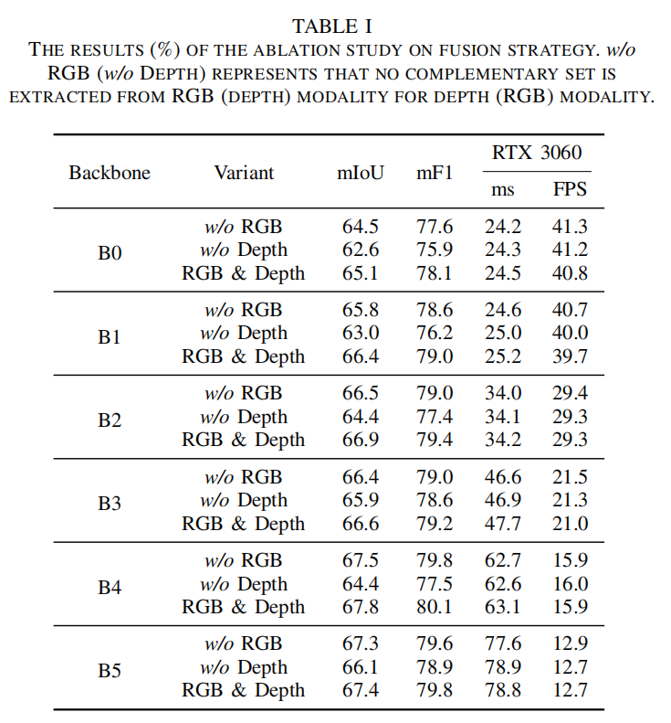
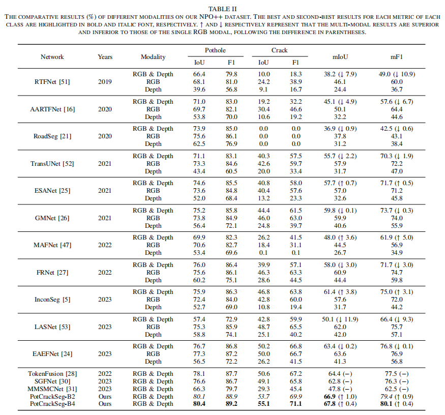
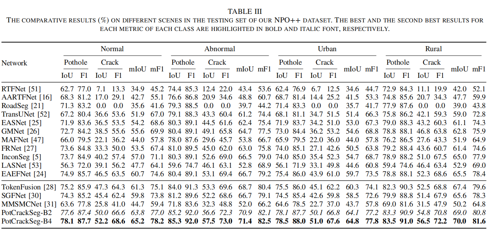
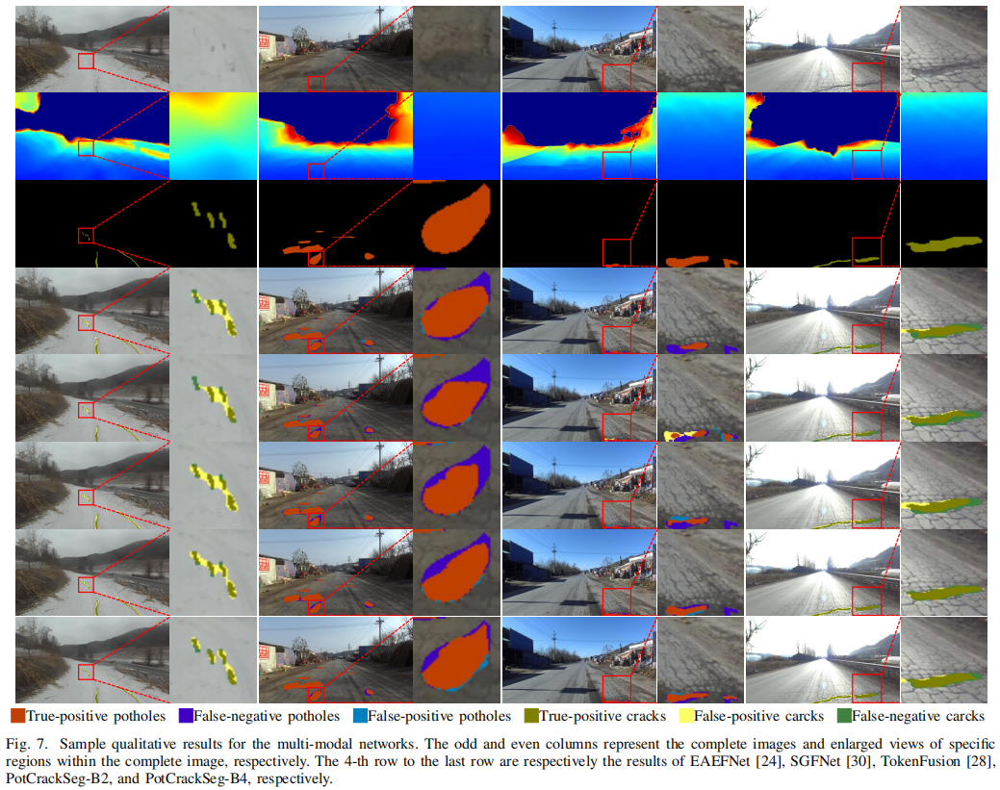

# 题目：[Segmentation of Road Negative Obstacles Based on Dual Semantic-feature Complementary Fusion for Autonomous Driving](https://ieeexplore.ieee.org/document/10468640)  
## 基于双语义特征互补融合的自动驾驶道路负面障碍物分割技术
**作者：Zhen Feng； Yanning Guo； Yuxiang Sun** 

**源码链接：** https://github.com/lab-sun/PotCrackSeg
****
# 摘要
道路负面障碍物（例如坑洼和裂缝）的分割对于自动驾驶的安全性至关重要。尽管现有的RGB-D融合网络能够达到可接受的性能，但它们大多数只对负面障碍物进行二进制分割，无法区分坑洼和裂缝。此外，它们的表现容易受到深度噪声的影响，在这种情况下，由噪声引起的深度数据的波动可能会使网络错误地将区域视为负面障碍物。为了解决上述问题，我们设计了一种新的RGB-D语义分割网络，该网络具有双重语义特征互补融合功能，用于道路负面障碍物分割。我们还为此任务重新标记了一个RGBD数据集，将道路坑洼和裂缝区分为两个不同的类别。实验结果表明，我们的网络与现有的知名网络相比，达到了最先进的性能。
# 关键词
- 语义分割
- RGB-D融合
- 负面障碍物
- 坑洼
- 裂缝
- 自动驾驶

# 引言
在自动驾驶领域，语义图像分割作为环境感知的核心任务之一，其目标在于像素级别对物体进行分类[1-4]。语义分割的关键应用之一是识别道路上的障碍物，这包括正面障碍物[5-8]和负面障碍物，即坑洼和裂缝[9, 10]。道路负面障碍物对自动驾驶的安全性构成了严重威胁，它们可能导致车辆在高速行驶时突然振动，甚至翻车[11]。因此，对坑洼和裂缝进行精确的分割对于自动驾驶技术极为重要。
现有的方法多采用单一的RGB图像或热成像图像来分割负面障碍物[12, 13]。然而，由于负面障碍物通常位于路面以下，其高度信息对于分割任务是有益的。因此，一些研究者开始利用深度数据，如点云[14]、深度图像和视差图像[15]来增强分割效果。为了进一步提升分割性能，部分方法尝试将深度数据与RGB数据融合[16, 17]。尽管如此，大多数现有方法仅对负面障碍物执行二进制分割，并未区分坑洼和裂缝[18, 19]。这种区分对于后续任务至关重要。例如，相较于裂缝，坑洼通常对车辆安全的影响更为显著，特别是在高速行驶的情况下，因此车辆应当更加关注坑洼。
此外，大多数方法使用立体相机获取深度数据，但这些数据在远距离或缺乏纹理的表面上容易受到噪声的影响。负面障碍物通常相对较浅，因此由噪声引起的深度数据波动可能导致现有网络错误地将噪声区域识别为负面障碍物。特别是对于透视图像，深度数据更容易受到下视相机噪声的影响。图1展示了一个由噪声引起的深度波动的例子。
为了解决上述问题，我们提出了一种基于双重语义特征互补融合策略的新型RGB-D语义分割网络。该策略不是简单地融合两个模态的所有特征，而是在解码器的最后阶段进行特征融合。这种结构确保了深度图像中的噪声不会影响编码阶段中RGB特征的提取。此外，我们的语义特征互补融合策略只从另一个模型中提取缺失的语义特征，这些特征在分割负面障碍物时是必需的。提取缺失的语义特征的方法可以避免深度图像噪声的影响，因为噪声通常不包含对象的语义特征。此外，我们对之前发布的NPO数据集[5]进行了重新标记，将道路坑洼和裂缝作为两个独立的类别进行区分。使用新标记训练的模型将能够区分这两个类别。
本工作的主要贡献如下：
1. 设计了一个双重语义特征互补融合（DSCF）模块，用于为每种模态提取互补的语义特征。
2. 提出了一个名为PotCrackSeg的新型RGB-D融合网络，该网络集成了DSCF模块，用于坑洼和裂缝的分割。
3. 通过重新标记现有NPO数据集的新类别（即坑洼和裂缝），我们升级了该数据集。我们的代码和数据集已经开源[1]。  

本文的结构如下：第二节回顾了相关工作；第三节描述了我们提出的网络；第四节介绍了我们重新标记的数据集；第五节讨论了实验结果；最后一部分是结论和未来的工作。

   

## II. 相关工作

### A. 多模态融合策略

直接串联和逐元素加法已被广泛用于多模态数据融合[20, 21]。为了改进融合策略，许多研究者采用了注意力模块进行融合。Zhou等人[22]设计了一个跨模态注意力融合模块，用于融合RGB和热成像图像中的互补信息。作者采用了两个分支来利用多头交叉注意力模块来开发互补信息，并通过逐元素加法融合两个分支的输出。Zhou等人[23]结合了模态注意力、空间注意力和相关注意力，设计了一个三重注意力融合模块来融合特征。Liang等人[24]提出了EAEFNet，它具有显式注意力增强融合模块，用于融合两种模态的特征。许多研究者设计了具有不同融合策略的融合模块。Seichter等人[25]设计了ESANet，它在融合之前使用挤压和激励模块重新加权特征。Zhou等人[26]提出了一个具有密集结构和不同膨胀率卷积的深度特征融合模块来融合特征。Zhou等人[27]设计了一个跨模态感知模块，通过三个阶段融合特征。Wang等人[28]提出了TokenFusion，它采用变换器结构来生成不同模态的融合令牌。Zhou等人[29]提出了一个分层多模态融合模块，用于融合RGB和热成像图像。Wang等人[30]在SGFNet中提出了一个语义引导融合模块，使用语义信息指导融合过程。Zhou等人[31]提出了一个记忆共享模块，通过三个分支融合特征。Feng等人[5]提出了一个残差引导融合模块，从深度数据中提取RGB图像缺失的特征。Yang等人[32]提出了一个语义调制的跨模态交互机制来融合不同的模态。

### B. 道路负面障碍物数据集

Liu等人[33]发布了DeepCrack数据集，用于检测和分割道路裂缝。该数据集包含537张分辨率为544×384的RGB图像。Nguyen等人[34]构建了2StagesCrack数据集，包含2000张分辨率为96×96的图像。Rateke等人[35]在RTK数据集[36]上构建了一个分割数据集，该数据集包含交通场景的RGB图像。他们手动标记了701张不同场景的图像，标记了包括坑洼和裂缝在内的11个类别。Guo等人[37]构建了UDTIRI数据集，包含1000张图像，这些图像来自在线资源、现有数据集[38]和自行收集的图像。Han等人[39]构建了Puddle-1000数据集，手动标记了包括985张由ZED相机拍摄的RGB图像在内的水坑。Arya等人[40]构建了一个大规模数据集RDD-2020，包含26620张图像，用于检测包括裂缝和坑洼在内的负面障碍物。他们使用智能手机在不同国家、不同天气和照明条件下收集图像。Bhatia等人[13]使用FLIR ONE热成像相机在变化的照明条件下获取图像，构建了道路坑洼分割数据集。他们从捕获的500张图像中手动标记了4904张图像，分辨率为240×295。Fan等人[16]发布了Pothole-600数据集，包含600对RGB图像和转换的视差图像，分辨率为400×400，用于道路坑洼分割。Feng等人发布了DRNO数据集[41]和NPO数据集[5]，用于负面障碍物分割。尽管已有许多数据集，但具有多模态图像的数据集仍然稀缺，且规模较小。此外，现有数据集仅提供二进制分割掩码，未区分两类。

### C. 道路负面障碍物分割方法

一些工作专注于道路裂缝的分割。Han等人[42]设计了CrackW-Net，采用跳级往返采样块结构来解决裂缝中断和背景噪声引起的误识别问题。Chen等人[43]设计了LECSFormer，提出了一个用于裂缝检测的密集结构解码器。Sun等人[10]提出了一个多尺度注意力模块，并将其放置在DeeplabV3+[44]的解码器中，用于道路裂缝分割。作者还在解码器中引入了高级和低级特征图的动态加权。Fan等人[45]设计了Parallel ResNet用于道路裂缝分割。Parallel ResNet由两个提出的平行ResNet模块组成。每个模块包含三个并行的残差卷积分支，分支的输出通过逐元素加法融合。Zhou等人[46]提出了一个用于裂缝检测的轻量级网络，通过将特征图分割为高分辨率阶段和低分辨率阶段。还有一些工作专注于道路坑洼的分割。例如，Masihullah等人[9]设计了一个耦合框架，结合DeeplabV3+和一个注意力模块，用于道路和坑洼分割。Fan等人[16]设计了AARTFNet和AAUNet，通过在编码器和解码器之间引入注意力模块来进行道路坑洼分割。Feng等人[47]设计了MAFNet，具有两种类型的基于注意力的融合模块，用于通过融合RGB图像和转换的视差图像进行坑洼分割。Katsamenis等人[48]设计了一个基于变换器结构的网络，用于道路坑洼分割。Liu等人[49]引入了一个坐标注意力模块到UNet，设计了一个网络，用于同时分割坑洼和裂缝。Feng等人[41]提出了AMFNet，用于道路和负面障碍物分割，具有一个自适应掩码融合模块。Feng等人[5]提出了InconSeg，以解决不同模态之间的不一致性，用于正面障碍物和负面障碍物的分割。

### D. 与现有方法的区别

我们的网络与前述网络在以下两个方面不同：1) 我们分割坑洼和裂缝，并区分这两个类别；2) 我们间接融合两种模态的数据。具体来说，我们计算每种模态缺失的语义特征，并从另一种模态中提取该语义特征进行融合。

   

### A. 整体架构

为了减轻噪声引起的RGB-D融合过程中的波动影响，我们提出了一个名为PotCrackSeg的网络，采用了双重语义特征互补融合策略。具体来说，我们不是融合包含噪声的所有特征，而是融合特征及其缺失的语义特征，因为噪声中的对象语义特征很少。因此，我们的PotCrackSeg首先从两种模态中提取特征，然后计算每种模态缺失的语义特征并提取缺失的特征。最后，我们的PotCrackSeg融合特征及其缺失的语义特征。

PotCrackSeg的整体架构，由一个RGB流、一个深度流和一个双重语义特征互补融合（DSCF）模块组成。DSCF模块包含两个流的最后部分、一个互补语义特征提取（CompSemFE）模块和一个分割头。RGB图像（表示为 $\mathbf{I}_ r$）和深度图像（表示为 $\mathbf{I}_d$）分别输入到RGB流和深度流。深度流的架构与RGB流相同。我们采用SegFormer[50]作为每个流的编码器，从输入数据中提取特征。RGB流的编码器有四个阶段。第$i$阶段的输出表示为 $\mathbf{A}_i^r$，其中 $i$ 表示RGB，$i \in [1, 4]$。 $\mathbf{I}_i^r$ 的分辨率是原始输入 $\mathbf{I}_r$ 分辨率的 $\frac{1}{2^{i+1}}$ 。每个阶段的输出通过多层感知（MLP）块处理，然后沿通道轴连接。由于特征图的分辨率不同，MLP块的输出对于最后三个阶段通过上采样层调整大小，以便在连接之前特征图具有相同的分辨率。连接结果包含RGB和深度编码器提取的所有特征，这些被称为RGB和深度特征集，并表示为 $\mathbb{R}$ 和 $\mathbb{D}$ ：

$$
\mathbb{R} = \{\mathbf{r}_ i | \mathbf{r}_ i = \text{up}_ \mathbf{r}(\text{mlp}_ \mathbf{r}(\mathbf{I}_i^r)), i \in [1, 4]\},
$$

$$
\mathbb{D} = \{\mathbf{d}_ i | \mathbf{d}_ i = \text{up}_ \mathbf{d}(\text{mlp}_ \mathbf{d}(\mathbf{I}_ i^d)), i \in [1, 4]\},
$$

其中 $mlp_\mathbf{r}(·)$ 指的是第 $i$ 阶段输出 $\mathbf{I}_ i^r$ 的第$i$个多层感知块，$up_ \mathbf{r}(·)$指的是第 $i$ 个MLP块的第 $i$ 个上采样层。$up1_\mathbf{r}(·)$ 指的是对输入没有操作（即，没有上采样层）。然后， $\mathbb{R}$ 和 $\mathbb{D}$ 的通道数通过一个卷积层、一个批量归一化层和一个ReLU层减少到3。数字3表示要分割的类别数，包括未标记的背景。ReLU层的输出表示为 $\mathbb{R}^3$ 和 $\mathbb{D}^3$。 $\mathbb{R}^3$ 和 $\mathbb{D}^3$ 都输入到DSCF模块。它们首先映射到语义特征集，并与每种模态的互补语义特征融合。DSCF模块的输出 $\hat{\mathbf{y}}$ 是整个PotCrackSeg的输出。

### B. DSCF模块

DSCF模块由四部分组成：用于将特征映射到语义特征集并补充语义特征的两个流的最后部分；一个用于提取互补语义特征的CompSemFE模块；一个用于生成分割图的分割头。首先，  $\mathbb{R}^3$ 通过语义特征集头映射到语义特征集。在语义特征集中，每个元素包含有关像素所属类别的信息。语义特征集表示为 $\mathbb{S}^3$。语义特征集头由一个卷积层组成。为了确保语义特征集头将 $\mathbb{R}^3$ 映射到语义特征集 $\mathbb{S}^3$ 中的负面障碍物，使用负面障碍物的语义信息来指导映射过程。在我们的DSCF模块中，我们采用地面真实作为指导信息。由于 $\mathbb{R}^3$ 的分辨率是输入图像 $\mathbf{I}_r$ 分辨率的 $\frac{1}{4}$ ，我们使用最近邻插值方法对地面真实进行下采样，生成指导信息 $\mathbf{y}_2$。该过程如下所述：

$$
\mathbb{S}^3_ i \leftarrow \mathbb{R}^3 : \mathbf{y}_ 2 = f(conv_ i(\mathbf{r})) | \mathbf{y}_2,
$$

其中$i \in \mathbb{R}^3$， $\mathbb{S}^3_i$ 是RGB语义特征集，位于 $\mathbb{S}^3$ 中。 $conv_i(·)$ 指的是卷积层的处理过程， $f(i|\mathbf{y}_2)$ 指的是使用 $\mathbf{y}_2$ 作为监督信息，通过交叉熵损失提取 $i$ 中相同语义信息的指导过程。深度语义特征集 $\mathbb{S}^3_d$ 以相同的方式生成：

$$
\mathbb{S}^3_d \leftarrow \mathbb{D}^3 : \mathbf{y}_ 2 = f(conv_d(\mathbf{d})) | \mathbf{y}_2,
$$

其中 $i \in \mathbb{D}^3$。生成 $\mathbb{S}^3_i$ 和 $\mathbb{S}^3_d$ 后，将它们、 $\mathbb{R}^3$ 和 $\mathbb{D}^3$ 输入到CompSemFE模块中，以提取集合 $\mathbb{S}^3$ 中的互补集( $\hat{\mathbb{S}}_r$ 和 $\hat{\mathbb{S}}_d$ )。 $\hat{\mathbb{S}}_r$ 和 $\hat{\mathbb{S}}_d$ 是输出的RGB流和深度流。接下来， $\hat{\mathbb{S}}^r_r$ 和 $\hat{\mathbb{S}}^d_d$ 通过上采样沿通道轴连接后融合。上采样层将 $\hat{\mathbb{S}}^r_r$ 和 $\hat{\mathbb{S}}^d_d$ 的分辨率调整为原始输入图像的分辨率。最后，融合结果输入到分割头以生成语义分割结果 $\hat{\mathbf{y}}$ 。分割头由一个卷积层组成。

   

### C. CompSemFE模块

CompSemFE模块的结构如图3所示。该模块有三个输入： $\mathbb{R}^3$ 和 $\mathbb{D}^3$ 的融合结果、RGB语义特征集 $\mathbb{S}^3_i$ 以及深度语义特征集 $\mathbb{S}^3_d$ 。模块的输出是RGB语义特征互补集 $\hat{\mathbb{S}}_r$ 和深度语义特征互补集 $\hat{\mathbb{S}}_d$。我们使用两个语义特征集头将融合结果映射到语义特征集。然后，我们从语义特征集中提取互补的语义特征。两个独立的特征提取块用于分别为 $\mathbb{S}^3_i$ 和 $\mathbb{S}^3_d$ 提取互补的语义特征。特征提取块由一个卷积层、一个批量归一化层和一个ReLU激活函数组成。

为了确保提取的互补集 $\hat{\mathbb{S}}_ r$ （ $\hat{\mathbb{S}}_ d$）是 $\mathbb{S}^3_i$ （ $\mathbb{S}^3_d$ ）在 $\mathbb{S}^3$ 中的互补集，我们计算 $\mathbb{S}^3_i$（ $\mathbb{S}^3_d$ ）在 $\mathbb{S}^3$ 中的真值互补集 $\mathbb{S}^3_{\text{gt}}$，并使用它作为指导信息来提取 $\hat{\mathbb{S}}_ r$ （ $\hat{\mathbb{S}}_ d$）。 $\mathbb{S}^3_{\text{gt}}$ 的计算如下：

$$
\mathbb{S}^3_{\text{gt}} = \mathbb{S}^3 - \mathbb{S}^3_i = \{\mathbf{s}_ {ij} | \mathbf{s}_ {ij} \neq \mathbf{s}_ {ii}, \mathbf{s}_ {ii} \in \mathbb{S}^3, \mathbf{s}_{ij} \in \mathbb{S}^3_i\},
$$

其中 $i$ 是 $\mathbb{S}^3$ 中元素的索引， $\mathbf{s}_ {ij}$ 和 $\mathbf{s}_{ii}$ 分别代表 $\mathbb{S}^3_i$ 中第 $j$ 个元素的第 $i$ 个特征和 $\mathbb{S}^3$ 中第 $i$ 个元素的第 $i$ 个特征。计算 $\hat{\mathbb{S}}_r$ 的过程如下：

$$
\hat{\mathbb{S}}_ r = f(\text{FE}_ r(\mathbb{R}^3 + \mathbb{D}^3) | \mathbb{S}^3_{\text{gt}} ),
$$

其中 $\text{FE}_r(\cdot)$ 指的是用于RGB模态的特征提取块的处理过程。 $\hat{\mathbb{S}}_d$ 的计算方式相同。最后，输出 $\hat{\mathbb{S}}_r$ 被送入RGB流并与 $\mathbb{S}^3_i$ 融合。类似地，输出 $\hat{\mathbb{S}}_d$ 被送入深度流并与 $\mathbb{S}^3_d$ 融合。

   

### D. 损失函数

我们使用了交叉熵损失函数 $\mathcal{L}_{\text{CE}}(\mathbf{y}, \hat{\mathbf{y}})$ 来计算地面真实 $\mathbf{y}$ 和分割结果 $\hat{\mathbf{y}}$ 之间的损失，计算如下：

$$
\mathcal{L}(\mathbf{y}, \hat{\mathbf{y}}) = -\frac{1}{I} \sum_{h=1}^{H} \sum_{w=1}^{W} \sum_{c=1}^{C} y_{hwc} \log(\hat{y}_{hwc}),
$$

其中 $H$ 和 $W$ 分别代表输入RGB图像的高度和宽度， $C$ 代表需要分割的类别数。 $\hat{y}_ {hwc}$ 指的是网络将图像中位置 $(h,w)$ 的像素分类为类别 $c$ 的概率。DSCF模块中有四个指导过程，其中两个过程指导语义特征的映射过程，另外两个过程指导互补语义特征的提取过程。我们也采用交叉熵损失来监督这些过程。对于RGB模态，我们使用 $\mathcal{L}_{\text{CE}}(\mathbf{y}_2, \mathbb{S}^3_i)$ 来监督 $\mathbb{S}^3_i$ 的生成，计算如下：

$$
\mathcal{L}_ {\text{CE}}(\mathbf{y}_ 2, \mathbb{S}^3_ i) = -\frac{1}{N} \sum_ {i=1}^{N} \sum_ {c=1}^{C} y_ {2ic} \log(\mathbb{S}^3_ i(i,c)),
$$

其中 $N$ 代表RGB语义特征集中元素的数量， $\mathbb{S}^3_ i(i,c)$ 代表 $\mathbb{S}^3_ i$ 中第 $i$ 个元素的第 $c$ 个特征。深度模态的损失 $\mathcal{L}_ {\text{CE}}(\mathbf{y}_ 2, \mathbb{S}^3_d)$ 以相同的方式计算。我们还使用 $\mathcal{L}_ {\text{CE}}(\mathbb{S}^3_{\text{gt}}, \hat{\mathbb{S}}_i)$ 来监督提取RGB语义特征集的互补集 $\hat{\mathbb{S}}_i$，计算如下：

$$
\mathcal{L}_ {\text{CE}}(\mathbb{S}^3_{\text{gt}}, \hat{\mathbb{S}}_ i) = -\frac{1}{N} \sum_{i=1}^{N} \sum_{c=1}^{C} \mathbb{S}^3_{\text{gt}}(i,c) \log(\hat{\mathbb{S}}_i(i,c)),
$$

其中 $\mathbb{S}^3_{\text{gt}}(i,c)$ 代表 $\mathbb{S}^3_{\text{gt}}$ 中第 $i$ 个元素的第 $c$ 个特征。 $C$ 代表类别数。深度模态的损失 $\mathcal{L}_ {\text{CE}}(\mathbb{S}^3_{\text{gt}}, \hat{\mathbb{S}}_d)$ 以相同的方式计算。

总的来说，我们使用上述5个损失函数来训练我们的PotCrackSeg网络。总损失定义为：

$$
\mathcal{L}_ {\text{total}} = \mathcal{L}_ {\text{CE}}(\mathbf{y}, \hat{\mathbf{y}}) + \sum_{m \in \{\text{RGB, Depth}\}} (\mathcal{L}_ {\text{CE}}(\mathbf{y}_ 2, \mathbb{S}^3_m) + \mathcal{L}_ {\text{CE}}(\mathbb{S}^3_{\text{gt}}, \hat{\mathbb{S}}_m)).
$$

其中 $m$ 代表RGB和深度模态。

## IV. NPO++ 数据集

为了提供坑洼和裂缝的独立真实标注，我们对现有的NPO数据集[5]进行了重新标注。NPO数据集是使用真实车辆从城市和乡村场景收集的，包含了各种天气和照明条件。该数据集包含手动标注的负面障碍物和正面障碍物的地面真实掩码。负面障碍物包括坑洼和裂缝，它们在之前被视为一个类别。在本项工作中，我们从总共4600张图像中将这两个类别——坑洼和裂缝——进行了区分。我们将升级后的数据集命名为NPO++。图5展示了我们数据集的一些样本图像。其中包含4032张包含坑洼的图像，超过500万个像素，以及723张包含裂缝的图像，超过42.7万个像素。数据集中图像的分辨率与NPO数据集相同，即288×512。我们遵循NPO数据集的规则，将图像划分为不同的场景。数据集包含2661张城市场景图像和1939张乡村场景图像。此外，还有3156张正常路面道路图像和1444张异常路面道路图像。据我们所知，我们的NPO++数据集是第一个区分道路坑洼和裂缝的RGB-D语义分割数据集。

   

## V. 实验结果与讨论

### A. 数据集

我们从NPO++数据集中随机分割出带有裂缝和坑洼标签的图像，将其分为三组，比例为2:1:1，即2300对图像用于训练；1150对图像用于验证；1150对图像用于测试。我们使用测试集来测试网络性能。我们还根据场景和路面将测试集中的图像划分为不同的子集。在测试集中，有480张乡村场景图像，670张城市场景图像，785张正常路面道路图像，以及365张异常路面道路图像。

### B. 训练细节

我们的网络使用PyTorch实现，并在配备两块NVIDIA RTX 3060显卡的PC上进行训练。PotCrackSeg编码器的参数使用从[50]提供的预训练权重进行初始化。其他参数按照PyTorch的默认设置进行初始化。我们使用AdamW优化器，初始学习率为$6 \times 10^{-5}$，并根据多项式学习率衰减方法，衰减率为0.9进行衰减。在训练开始的前10个epoch进行学习率预热。

### C. 消融研究

1) **模态消融研究**：我们首先设计了一个仅使用RGB模态的变种，通过从PotCrackSeg中移除深度流的编码器和解码器以及DSCF模块。其次，我们设计了一个仅使用深度模态的变种，通过移除RGB流的编码器和解码器以及DSCF模块。最后，我们在上述变种的基础上，使用SegFormer-B0, SegFormer-B1, SegFormer-B2, SegFormer-B3, SegFormer-B4, 和 SegFormer-B5（简称为B0, B1, B2, B3, B4, 和 B5）作为编码器，设计了几个变种。我们使用均值F分数（mF1）和均值交叉验证（mIoU）[5]来评估每个变种在坑洼和裂缝上的性能。我们还测量了多模态融合变种的推理速度。变种的结果在图6中展示。图6显示，带有我们提出的DSCF模块的变种的性能优于单模态变种。这表明我们提出的DSCF模块可以通过融合含噪声的RGB和深度图像来提高性能。结果还表明，使用B4编码器的多模态变种在所有变种中表现最佳。此外，使用B2编码器的多模态变种达到了实时推理速度（每秒30帧）。基于这些结果，我们选择了两个版本的PotCrackSeg：轻量级PotCrackSeg-B2，使用B2作为编码器；重量级PotCrackSeg-B4，使用B4作为编码器。

   

2) **融合策略消融研究**：我们进行了实验以展示双重语义特征互补融合策略带来的益处。具体来说，我们设计了一些单模态互补融合策略的变种，将它们与我们提出的PotCrackSeg进行比较。单模态互补融合策略如下：

   - w/o RGB：不从RGB语义特征集中提取互补集用于深度模态。相反，从深度语义特征集提取互补集并融合到RGB语义特征集中。
   - w/o Depth：不从深度语义特征集中提取互补集用于RGB模态。相反，从RGB语义特征集提取互补集并融合到深度语义特征集中。

我们使用上述单模态互补融合策略设计了几个不同编码器的变种。所有变种都使用相同的方法和数据集进行训练和测试。我们还测试了所有变种的推理速度。结果显示在表I中。结果表明，带有双重语义特征互补融合策略的变种优于单模态互补融合策略的变种。结果证明了双重语义特征互补融合策略可以更好地融合两种模态的特征并取得更好的结果。不同变种的推理速度表明，双重语义特征互补融合策略与单模态语义特征融合策略相比，推理时间并没有显著增加。比较w/o Depth和w/o RGB的结果，可以发现w/o RGB的结果优于w/o Depth。我们推测可能的原因是原始RGB语义特征集包含的有效信息比深度语义特征集多。值得注意的是，w/o RGB的结果优于单一RGB模态的结果，w/o Depth的结果也优于单一深度模态的结果。这表明语义特征互补融合策略可以避免噪声的影响。然而，w/o Depth的结果劣于单一RGB模态的结果。我们推测网络在DSCF模块中提取互补特征的结构较简单，导致无法从RGB语义特征集中提取足够的互补特征给深度语义特征集。

   

3) **融合模块消融研究**：我们通过将DSCF模块替换为InconSeg[5]中的残差引导融合（RGF）模块、AMFNet[41]中的自适应掩码融合（AMF）模块、MAFNet[47]中的通道注意力融合（CAF）模块和双重注意力融合（DAF）模块，设计了几个变种。比较结果显示在表IV中。我们可以看到，采用我们提出的DSCF模块（即PotCrackSeg）作为主干网络的变种取得了最佳结果。这表明我们提出的DSCF模块在处理RGB和深度图像融合时更为有效，尤其是在深度图像中存在噪声的情况下。

### D. 比较研究

我们比较了我们提出的PotCrackSeg网络与一些知名的网络：RTFNet [51]、AARTFNet [16]、RoadSeg [21]、TransUNet [52]、ESANet [25]、GMNet [26]、MAFNet [47]、FRNet [27]、InconSeg [5]、LASNet [53]、EAEFNet [24]、TokenFusion [28]、SGFNet [30] 和 MMSMCNet [31]。所有网络都是使用多模态RGB-D图像进行训练的。前11个网络被修改为接受单一模态输入，以展示多模态融合的性能。网络RTFNet、AARTFNet、RoadSeg 和 TransUNet 通过简单的逐元素加法或串联融合多模态特征。其他网络则采用基于注意力或设计策略的融合模块来融合多模态特征。注意，LASNet 和 SGFNet 需要地面真实二进制信息和边界信息进行训练，因此我们将地面真实标签转换为二进制信息，并从地面真实标签中提取边缘作为边界信息。

   

 1) **定量结果**

定量结果展示在表II中。我们可以发现，RTFNet、AARTFNet、RoadSeg 和 TransUNet 的多模态融合结果比使用单一RGB模态的结果要差。这说明简单的逐元素加法融合或串联融合策略并不能减轻噪声的影响。比较前十张网络中其他网络的结果，我们可以发现，ESANet、MAFNet 和 InconSeg 在融合含噪声的RGB-D图像时的性能优于仅使用RGB图像。GMNet、FRNet 和 EAEFNet 的多模态融合结果比使用单一RGB模态的结果要差。这表明深度图像中的噪声影响了融合结果，甚至对某些网络来说降低了融合结果。ESANet 和 MAFNet 采用基于注意力的融合模块来融合特征，而 InconSeg 则使用特征互补策略来融合特征。然而，EAEFNet 也采用了基于注意力的融合模块来融合特征，但其融合结果却不如单一RGB模态的结果。这表明适当的融合模块和策略可以克服深度图像中的噪声对融合过程的影响。与ESANet、MAFNet 和 InconSeg 的性能提升相比，我们网络的性能提升并不是最好的。此外，重量级PotCrackSeg-B4的性能提升低于轻量级PotCrackSeg-B2。我们推测这一结果主要是由于我们的编码器可能提取了更多的有效语义特征，留下较少的互补语义特征可供提取，从而导致性能提升较低。总体而言，我们提出的PotCrackSeg在所有比较的网络中取得了最佳结果，无论是轻量级还是重量级。

 2) **效率**

图8展示了网络的效率。我们可以看到，我们的轻量级PotCrackSeg-B2拥有最少的参数和第三快的推理速度。尽管EASNet和FRNet的速度比PotCrackSeg-B2快，但PotCrackSeg-B2在分割性能上比它们高出大约10%。我们的重量级PotCrackSeg-B4在所有网络中的参数量和推理速度也处于中等水平。结果表明，PotCrackSeg在准确性和速度之间提供了一种权衡。

   

3) **不同场景下的结果**

我们还在不同场景下测试了多模态网络的性能。我们使用训练集中的所有图像来训练网络，并使用测试集中不同场景的图像来评估性能。表III显示了结果，说明了我们的网络在所有场景中都取得了最佳结果。这表明我们提出的网络可以推广到广泛的场景。比较不同场景的结果，我们发现所有网络在异常路面道路和乡村场景中的结果比在正常路面道路和城市场景中的结果要好。我们推测的原因是正常路面道路和城市场景中坑洼和裂缝的纹理与路面相似，使得坑洼和裂缝的分割更加困难。另一个可能的原因是乡村场景中由于道路缺乏有效的修复，导致大面积的坑洼和裂缝，使得分割更容易。

   

4) **定性展示**

表II中前5名的多模态融合网络的一些样本定性结果如图7所示。从第一列可以看出，分割远距离不连续的裂缝是一个挑战。结果表明，几乎所有的网络都错误地将远距离不连续的裂缝分类为一个连续的裂缝。相比之下，我们的PotCrackSeg-B4能够更准确地分割独立的裂缝。这表明我们的网络在细节上具有高精度。第二和最后一列还表明，我们的PotCrackSeg在边缘的精度上优于其他网络。第三列显示EAEFNet、SGFNet和TokenFusion只正确分割了一小部分坑洼。然而，我们的PotCrackSeg正确分割了大部分坑洼。结果表明，我们的PotCrackSeg在分割道路坑洼和裂缝方面取得了最佳性能。

## VI. 结论与未来工作

在本文中，我们提出了一个名为PotCrackSeg的新型网络，它采用了双重语义特征互补融合模块，用于交通场景中坑洼和裂缝的分割。我们将两种模态的特征映射到语义特征集，并为每种模态提取互补的语义特征，以提高融合性能。我们的网络减轻了深度图像中的噪声引起的性能下降。此外，我们通过区分坑洼和裂缝，升级了现有的大规模RGB-D数据集。实验结果表明，我们的PotCrackSeg在融合含噪声的RGB-D图像方面，性能优于使用单一模态（即RGB和深度）。此外，结果还表明，PotCrackSeg在准确性和推理速度方面均优于其他知名网络。
尽管我们的网络实现了最先进的结果，但仍然存在一些局限性。例如，DSCF模块提取互补语义特征的结构较为简单，这使得它在提取足够的互补语义特征方面效果不佳。因此，未来的工作中，我们希望能够设计出一个合适的结构来提取互补语义特征，以提高融合性能。此外，我们还计划测试网络在不同噪声水平的损坏输入上的鲁棒性。

